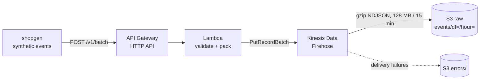

# events-pipeline-aws-terraform

Serverless event ingestion on AWS: an HTTP endpoint receives batches of product events, a Lambda validates them, and Kinesis Data Firehose lands them in S3 as gzipped NDJSON, partitioned by arrival hour. Everything is Terraform. Running it costs about **$1 a month per 10 million events**.

It is the first piece of a small end-to-end data platform for a fictional online coffee shop. It also ships the synthetic data generator the rest of the platform uses.



## Quickstart

```bash
make setup     # uv sync
make test      # 19 tests, no AWS account needed
make sample    # 1,000 sessions of synthetic events to data/sample.ndjson
```

To deploy (needs AWS credentials):

```bash
cp terraform/terraform.tfvars.example terraform/terraform.tfvars   # set ingest_token
make deploy
make send URL=$(terraform -chdir=terraform output -raw ingest_url) TOKEN=<your token>
```

`make destroy` removes everything, including the bucket, outside `prod`.

## The data

`shopgen` generates sessions on web, iOS and Android: product views, add to cart, checkout, order and payment. It is deterministic for a given seed, and it deliberately produces the problems a real event stream has:

| Problem | How it shows up | Who fixes it |
|---|---|---|
| Duplicates | Same `event_id` sent twice, as a client retry would | Deduplication downstream, by `event_id` |
| Late events | Mobile sessions where `sent_at` is 2 to 30 hours after `occurred_at` | Repartitioning by event time downstream |
| Identity stitching | A session starts with only `anonymous_id` and gets a `customer_id` at checkout | Identity resolution in the warehouse |

## Design decisions

- **One Firehose record per batch, not per event.** Firehose bills each record rounded up to 5 KB. Packing events as NDJSON into records of up to 1,000 KiB cuts the Firehose line about 5x for 1 KB events. See [docs/cost.md](docs/cost.md).
- **At-least-once, deduplicate later.** If a record still fails after retries, the endpoint returns 503 and the client resends the whole batch. That can create duplicates, which is fine: every event has an `event_id`, and the next layer drops repeats. Exactly-once at the edge would cost far more than a `ROW_NUMBER()` downstream.
- **Validate at the edge, keep it shallow.** The Lambda checks required fields, the event name, the timestamp and size, and counts rejections by reason. Business rules belong in the warehouse, where they are tested and versioned.
- **Partition by arrival time.** Firehose can only use the arrival timestamp without parsing every record. Late events land in the hour they arrived; the next layer repartitions by `occurred_at`.
- **Largest buffers Firehose allows.** 128 MB or 15 minutes. Fewer, larger files make every downstream read cheaper.
- **Least privilege.** The Lambda can only `PutRecordBatch` on one stream. Firehose can only write to one bucket and one log group, and its role requires the account ID as external ID.
- **Raw data ages out of Standard.** Lifecycle moves events to Standard-IA at 30 days and Glacier Instant Retrieval at 90. Delivery errors expire after 30 days.

## Limits

- The token is a shared secret in a Lambda environment variable, fine for a demo. In production use Secrets Manager or a Lambda authorizer.
- No dead-letter queue: a batch that keeps failing is the client's to retry.
- One region, no cross-region replication.

## Repo layout

```
src/shopgen/    synthetic event generator (CLI: python -m shopgen)
src/ingest/     Lambda handler, packaged as-is by Terraform
src/costmodel/  monthly cost model (python -m costmodel)
terraform/      API Gateway, Lambda, Firehose, S3, IAM
tests/          generator, handler and cost model tests
```

## License

MIT
